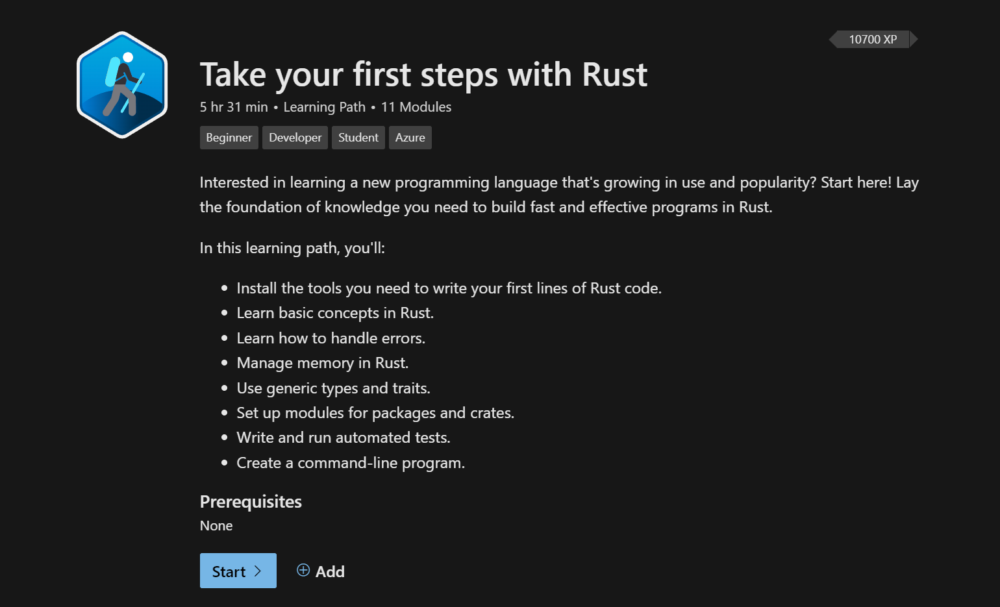
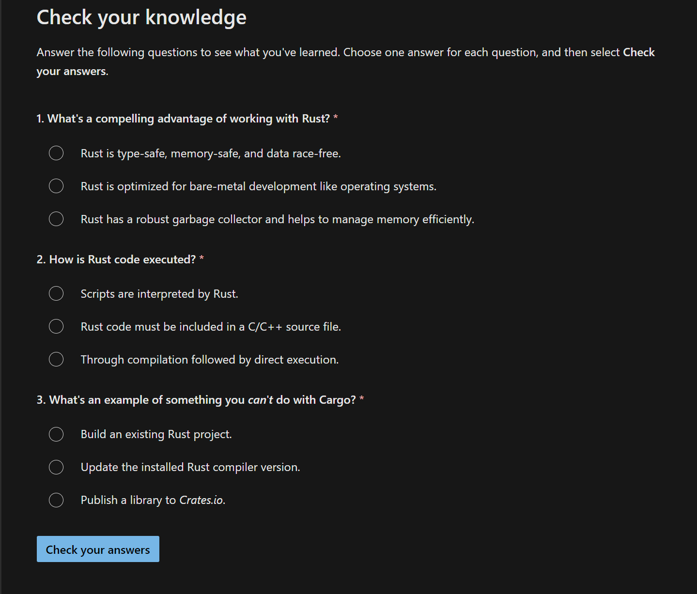
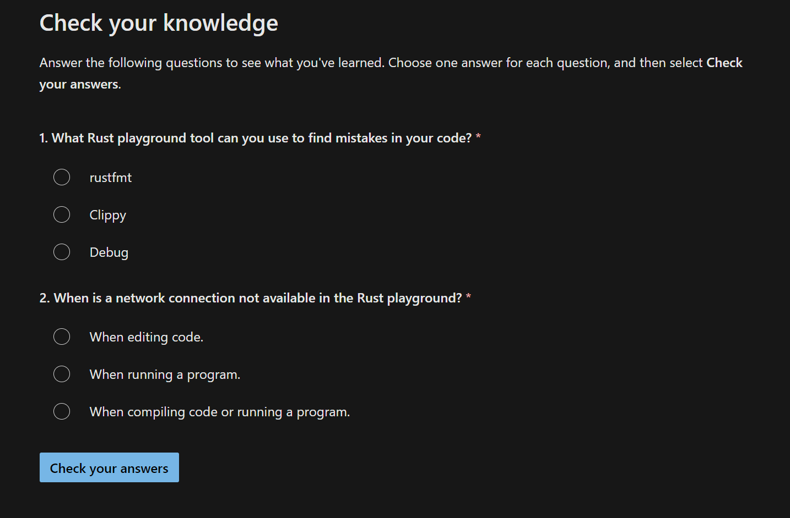

### 1

Переходимо за [посиланням](https://learn.microsoft.com/en-us/training/paths/rust-first-steps/) та авторизуємося. Це треба зробити для того щоб ви не втрачали свій прогрес, тому що потім треба буде продемонструвати результат.

### 2

Для того щоб почати треба натиснути синю кнопку `Start`:

### 3

Перші два кроки розбирались на лекції. Можна пройти їх, закріпивши свої знання.

### 4

На третьому кроці буде інформація про основні можливості Rust.

Нас познайомлять з cистемою модулів Rust, пакетним менеджером Cargo та кількома популярними крейтами.

### 5

- Crate — це мінімальна одиниця компіляції в Rust. Кожен крейт являє собою окремий проєкт чи бібліотеку. Крейт може бути виконуваним (binary crate) або бібліотечним (library crate). Кожен крейт компілюється незалежно, що дозволяє збирати й використовувати код повторно в різних проєктах.

- package - це те, що публікується. Він може містити один або декілька крейтів. Пакет визначає структуру проєкту і включає крейти, документацію, метадані та інші необхідні файли для того, щоб бути опублікованим і розповсюдженим.

- Cargo - це менеджер пакетів для Rust, який компілює крейти, управляє залежностями та публікаціями. Cargo автоматизує процеси, пов'язані з побудовою проєктів (крейти), завантаженням залежностей та публікацією на crates.io.

- paths - це структура, яка дозволяє доступ до елементів крейту або модуля. Шляхи використовуються для імпорту модулів, функцій, структур та інших компонентів в Rust. Вони можуть бути абсолютними або відносними.

- module - це структурна одиниця коду, що дозволяє організовувати код у зручні для керування блоки. Модулі допомагають структурувати код, приховувати внутрішню реалізацію та розділяти різні частини проєкту для кращого управління і читабельності.

### 6

взаємозв'язок Crate - package:
Крейт — це одиниця, що компілюється, тоді як пакет — це те, що публікується і може містити кілька крейтів.

### 7

взаємозв'язок Cargo - crate:
Cargo компілює крейти, керує залежностями та забезпечує публікацію на crates.io.

### 8

взаємозв'язок Crate - module
Модуль це структурна одиниця коду. А крейт це структурна одиниця компіляції. Кожен крейт є модулем але не кожен модуль є крейтом.

### 9

взаємозв'язок Cargo - package:
Cargo допомагає розповсюджувати пакети, що складаються з одного чи кількох крейтів, через crates.io.

### 10

В кінці буде невеличкий тест на закріплення знань.
Давайте пройдемо його.

### 11

У наступному кроці нас знайомлять з `Rust playground`.
`Rust playground` це важливий інструмент екосистеми Rust який використовують розробники для того щоб ділитись кодом з іншими розробниками та була можливість зробити маленький експеримент або перевірити свою гіпотизу. Знаходиться цей інструмент за адресою `https://play.rust-lang.org/`.

### 12

Також нам пропонують перевірити свої знання на невеликому тесті.
Давайте пройдемо його.

### 13

Далі нас навчать користуватись `Rust playground` та ділитись своїм кодом.

### 14

Напишемо просту программу у `Rust playground` та навчимось ділитись кодом з іншими.
Приклад програми:

### 15

Щоб поділитись кодом з іншими, треба натиснути на кнопку `Share`:

### 16

Далі порібно згенерувати унікальне постійне посилання:

Тепер можна скопіювати посилання і ділитись своїм кодом.

### 17

У останньому кроці нас знайомлять з [Rust cookbook](https://rust-lang-nursery.github.io/rust-cookbook/). В ній зібрані приклади вирішення типових задач програмування, саме на мові Rust.
